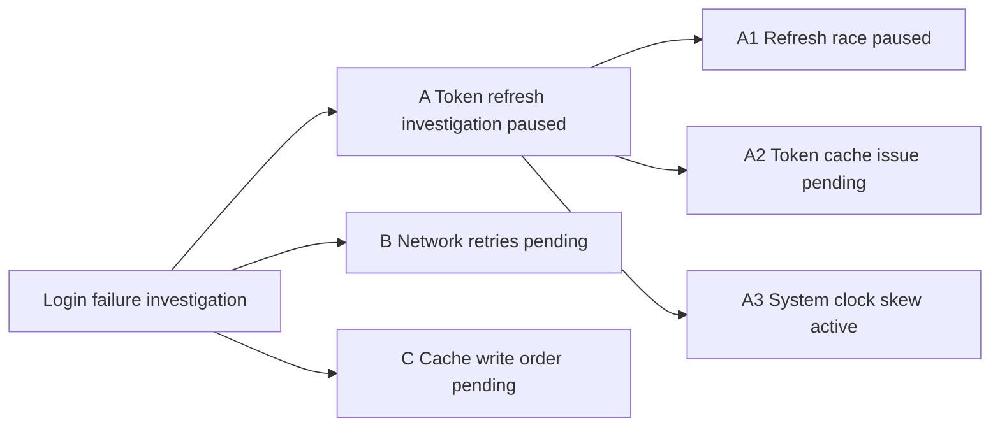

# Trailmap Usage Guide

[Product overview](../README.md) · [中文使用说明](USAGE.zh-CN.md)

Trailmap records decision points and exploration paths for a workspace. This guide describes the complete command behavior. The behavioral source of truth is [`trailmap/SKILL.md`](../trailmap/SKILL.md).

## Core concepts

### Topic

A Topic is one independently trackable problem or work line, such as "Login timeout investigation." A topic is not tied one-to-one to a chat: one chat can contain multiple topics, and a topic can continue across chats.

### Path

A Path is one exploration direction. Its `key`, such as `A`, `B`, `A1`, or `P2`, is both the short human identifier and the only internal path identifier. Keys must be unique inside a topic and cannot be renamed in v1.

### Parent

Each path has an optional Parent reference. A root path has `parent: null`; a child path stores its parent's `key`. Trailmap derives the tree from these references and does not store a `children` array.

### Active Path

The Active Path is the direction currently being explored. Each topic has at most one active path. The topic's `active` field is either that path's `key` or `null`.

### Created From

Created From records why a path was created and the facts, assumptions, and constraints available at that branch point. It lets `resume clean` reconstruct the target path without importing detailed reasoning from sibling paths.

## Installation and invocation

Install the repository's `trailmap/` directory as an Agent Skill. See the [product README](../README.md#install) for Codex and Claude Code installation commands.

Codex invocation:

```text
$trailmap <subcommand>
```

Claude Code invocation:

```text
/trailmap <subcommand>
```

Arguments after the invocation are direct subcommands. The examples below use Codex syntax; replace `$trailmap` with `/trailmap` in Claude Code.

## Command reference

```text
$trailmap
$trailmap pending <idea>
$trailmap list
$trailmap show [key]
$trailmap update <key>
$trailmap subagent <key>
$trailmap subagent <key> --worktree
$trailmap subagent <key> --worktree --base <ref>
$trailmap resume <key> clean|informed
$trailmap resume <topic_id> <key> clean|informed
$trailmap close <key> done|blocked|discarded
$trailmap rename <topic title>
$trailmap map [text]
```

## Create Paths

### Create root or child paths

Use the base command with a natural-language description of the branch:

```text
$trailmap Login failures may come from token refresh or network retries. Start with token refresh.
```

```text
A  Token refresh investigation  [active]
B  Network retries              [pending]
```

Result: Trailmap creates paths A and B. Use `$trailmap map` to view the path tree.

The AI chooses short unique keys by default, commonly `A/B/C` for roots and `A1/A2` for children. You can request explicit keys such as `P1/P2`; Trailmap checks for conflicts and never overwrites an existing key.

If there is no active topic, Trailmap drafts a new topic and root paths. Root paths use `parent: null`; one becomes `active`, and the rest become `pending`.

To request subagent exploration for a new non-active path, add `--subagent`:

```text
$trailmap Login failure may be token or network; start token --subagent B --allow-shared-code
$trailmap Login failure may be token, network, or cache; start token --subagent B,C --worktree
```

### Add child paths

If an active topic and Active Path already exist, the base command means that the current path has split into child directions. After confirmation, Trailmap:

1. appends a leave-summary to the current path
2. changes the current path from `active` to `paused`
3. creates child paths whose `parent` is the previous active path's `key`
4. makes one child `active` and the others `pending`
5. updates `topic.active` to the new active child's key

Example:

```text
$trailmap A may contain a cache bug or a refresh race. Investigate the refresh race first.
```

```text
A  Token refresh investigation  [paused]
├─ A1  Refresh race             [active]
└─ A2  Cache inconsistency      [pending]
B  Network retries              [pending]
```

Result: Trailmap creates A1 and A2 under A.

### Add a sibling pending path

Use `pending <idea>` when another possibility occurs to you but the current path must remain active:

```text
$trailmap pending The cache write order may be wrong; remember it without switching.
```

The new path:

- has the same `parent` as the current active path, so it is a sibling
- starts with `status: pending`
- does not produce a leave-summary for the current path
- does not change the current path's status
- leaves `topic.active` completely unchanged

If the current active path is `A`:

```text
$trailmap pending System clock skew may be involved; remember it without switching.
```

```text
A  Token refresh investigation  [active]
B  Network retries              [pending]
C  System clock skew            [pending]
```

Result: Trailmap creates C, and A remains active.

If the current active path is `A1`:

```text
$trailmap pending The cache write order may be wrong; remember it without switching.
```

```text
A  Token refresh investigation  [paused]
├─ A1  Refresh race             [active]
├─ A2  Cache inconsistency      [pending]
└─ A3  Cache write order        [pending]
B  Network retries              [pending]
```

Result: Trailmap creates A3, and A1 remains active. In other words, `pending` always places the new path beside the current active path, not at the topic root.

Use the base command, not `pending`, when the current path itself is splitting into child paths.

You can also start subagent exploration for the new sibling path:

```text
$trailmap pending Network retry may be the cause --subagent --allow-shared-code
```

The new path remains `pending`; subagent progress is tracked separately as `agent_run`.

### List all topics

```text
$trailmap list
```

`list` is a cross-topic workspace dashboard. For every topic, it groups paths by:

```text
active
pending
paused
closed
```

Active, pending, and paused paths show their key and title, plus a compact code-change warning when useful. Paths with subagent state append compact execution status such as `[pending, subagent running]`. Closed paths also show `closed_as` and `closed_reason`, but not their full update history.

For worktree subagent runs, `list` keeps this compact and appends worktree state, for example `[pending, subagent running, worktree]`.

### Show topic or path details

```text
$trailmap show
```

With no key, `show` displays the active topic, its Active Path, recent active-path updates, pending and paused alternatives, and closed paths with closure reasons.

```text
$trailmap show B
```

`show [key]` displays one path inside the active topic, including its `created_from`, description, complete updates, code-change details, latest `agent_run` fields, subagent handoff/report summary when available, and closure fields when applicable.

For worktree subagent runs, `show <key>` also displays the worktree path, worktree branch, base ref, base sha, whether the main workspace was dirty when the worktree was created, changed files, and diff summary.

`show <topic_id>` is not supported in v1. Use `list` to find topics and cross-topic `resume` to activate one.

### Update path progress

```text
$trailmap update <key>
```

Trailmap drafts a structured update containing:

```text
time
summary
conclusion
status_after
closed_as, only when status_after=closed
codechange.changed
codechange.files
codechange.summary
```

The concise confirmation view normally shows only the path key, summary, conclusion, resulting status, and relevant code changes. After confirmation, the update is appended to the path and its top-level status is synchronized.

When `status_after` is `closed`, Trailmap also records closure fields. When a path is not closed, top-level closure fields must be absent.

### Start subagent exploration for an existing path

```text
$trailmap subagent <key>
$trailmap subagent B
$trailmap subagent B --informed --allow-shared-code
$trailmap subagent B --worktree
$trailmap subagent B --worktree --informed
$trailmap subagent B --worktree --base origin/main
```

`subagent <key>` starts subagent exploration for an existing path in the active topic. The target path must exist, must not be the current main active path, must not be closed, and must not already have `agent_run.status: running`.

Trailmap keeps the main active path unchanged. The target path keeps its lifecycle status, usually `pending` or `paused`, and receives an execution overlay:

```text
B  Network retries  [pending, subagent running]
```

By default, Trailmap shows a shared workspace warning before starting the subagent. The warning exists because the subagent and the main active path may both modify the same files. `--allow-shared-code` accepts that risk and skips the separate shared-code prompt, but it does not skip the Trailmap write confirmation.

If the runtime has no subagent tool available, Trailmap should not fail the path operation. It records `agent_run.status: blocked` with a concise reason after confirmation.

### Run a subagent in a worktree

Worktree mode is opt-in. Use `--worktree` when a subagent path may make code changes that should be isolated from the main active path:

```text
$trailmap subagent B --worktree
$trailmap subagent B --worktree --informed
$trailmap subagent B --worktree --base origin/main
```

`--worktree` and `--allow-shared-code` are mutually exclusive. Use shared workspace mode when you accept file-level interference risk; use `--worktree` when you want a separate local Git worktree.

The base defaults to `HEAD`. `--base <ref>` overrides it. If `--base <ref>` cannot be resolved, Trailmap blocks that subagent run and does not fall back to `HEAD`.

Default worktree locations are:

```text
.worktrees/trailmap/<topic-id>/<path-key>/
trailmap/<topic-id>/<path-key>   # branch
```

If the directory is non-empty or the branch already exists, Trailmap appends the same unique suffix to the worktree path and worktree branch. It does not reuse existing non-empty directories or branches.

Main-workspace uncommitted changes are not copied into the worktree. Trailmap records `base_dirty: true` when the main workspace has uncommitted changes at worktree creation time.

### Worktree confirmation and safety

Before creating a worktree, Trailmap shows a confirmation draft containing the path, context mode, base ref and sha, branch to create, worktree path, whether the main workspace has uncommitted changes, whether `.gitignore` will be updated, and the safety notes.

`.worktrees/` must be ignored before creating project-local worktrees. If it is not ignored, Trailmap may append only this line to `.gitignore` after confirmation:

```text
.worktrees/
```

Trailmap does not merge, commit, clean up, or apply worktree changes automatically. It also does not stash, revert, copy files, or switch the main workspace branch.

### Worktree results

For worktree runs, subagent reports also include:

```text
worktree.path
worktree.branch
worktree.base_ref
worktree.base_sha
worktree.changed_files
worktree.diff_summary
```

Trailmap derives `codechange.files` from the worktree diff against `agent_run.worktree.base_sha`, not from the main workspace. If the diff cannot be read, it records `changed: true`, an empty file list, and `Worktree diff unavailable; inspect worktree manually.`

When a worktree subagent reports, Trailmap keeps it as a retained worktree by default and records `agent_run.worktree.status: retained`. The first worktree version does not remove worktrees automatically.

### Start subagent exploration for new paths

Subagent startup can also be attached to new non-main-active paths:

```text
$trailmap pending Network retry may be the cause --subagent --allow-shared-code
$trailmap Login failure may be token or network; start token --subagent B --allow-shared-code
$trailmap Login failure may be token, network, or cache; start token --subagent B,C --allow-shared-code
$trailmap pending Network retry may be the cause --subagent --worktree
$trailmap Login failure may be token, network, or cache; start token --subagent B,C --worktree
```

When a command creates non-main-active paths and no `--subagent` flag is present, Trailmap asks whether to start subagent exploration for zero, one, or multiple candidate paths. If `--subagent B,C` is present, those keys are selected directly.

`--allow-shared-code` is risk acceptance, not write-confirmation bypass. Trailmap still shows the new path and `agent_run` draft and waits for explicit confirmation before writing state.

### Subagent context modes

Subagent context defaults to `clean`. Clean context contains the topic title, target path `created_from`, target path description, target path updates, minimal current active path identity, shared workspace risk, and the required report schema. It excludes detailed sibling-path reasoning.

Use `--informed` when the subagent should also receive summarized sibling, parent, current-active, or previously explored path conclusions. Trailmap labels that material as **other-path context**.

### Subagent reports

Subagents return a fixed report:

```text
path_key
summary
conclusion
status_after
closed_as, only when status_after=closed
codechange.changed
codechange.files
codechange.summary
handoff
```

When a subagent returns, Trailmap records or presents the run as `reported` and converts the report into a normal `update <key>` draft. You must confirm before Trailmap writes the update, changes the path status, writes closure fields, or marks `agent_run.status` as `completed`.

If you reject the update draft, Trailmap does not write the update, does not alter code, and keeps `agent_run.status` as `reported`.

Subagents may recommend `status_after: closed` and `closed_as`, but they cannot directly close a path.

### Resume with clean or informed context

Switch paths inside the active topic:

```text
$trailmap resume <key> clean|informed
```

Switch topics and paths together:

```text
$trailmap resume <topic_id> <key> clean|informed
```

Before switching, Trailmap drafts a leave-summary for the current Active Path and normally changes it to `paused`. The confirmation shows the target, selected mode, status transition, and code-change warnings. After confirmation, the target becomes `active`, `topic.active` changes to its key, and a cross-topic resume also updates `index.active_topic_id`.

If the target is closed, Trailmap warns that resuming it will reopen the path and asks for explicit confirmation. Reopening appends an update and removes top-level `closed_as`, `closed_reason`, and `closed_at`; the historical closure remains in `updates`.

If the target path is currently being explored by a subagent, Trailmap warns that resuming it in the main session may duplicate work or mix context. The warning does not block the resume.

### Resume paths with retained worktree changes

If the target path has a retained worktree with changed files or a diff summary, Trailmap warns that those code changes are not merged into the current workspace. `resume clean` may include the target path's own worktree artifact summary, but it will not apply those changes and will not include unconfirmed full handoff reasoning.

#### clean

`clean` includes only:

- the target path's `created_from`
- the target's title, goal, and hypothesis
- the target's own updates
- constraints recorded at creation
- warnings about recorded or current code changes

It excludes detailed sibling-path reasoning. Use it when conclusions reached on A should not bias a fresh investigation of B.

#### informed

`informed` includes the clean context plus summarized conclusions from sibling, parent, or previously explored paths. Trailmap labels that material as **other-path context** so its origin remains visible.

Neither mode changes Git state or isolates working-tree files. `clean` means clean conversational context, not a clean checkout.

### Close a path

```text
$trailmap close <key> done|blocked|discarded
```

Closing requires one classification:

```text
done       completed, confirmed, or resolved
blocked    cannot continue under current conditions
discarded  disproved, unhelpful, or intentionally abandoned
```

Trailmap drafts the key, `closed_as`, closure reason, final summary, and relevant code-change information. After confirmation it appends a closing update, sets the path status to `closed`, and writes `closed_as`, `closed_reason`, and `closed_at`.

If the closed path was active, `topic.active` becomes `null`. Trailmap does not automatically activate another path; use `resume` explicitly.

### Rename the active topic

```text
$trailmap rename <topic title>
```

This changes only the active topic's title after confirmation. It does not rename path keys or path titles.

### Generate a Mermaid or text map

```text
$trailmap map
```

Example output:



`map` outputs one Mermaid `graph LR` for the active topic. It derives the graph from `paths[].parent` and displays `key`, title, status, `closed_as` for closed paths, and compact subagent state when present. It does not include complete updates.

For worktree subagent runs, `map` shows compact worktree state only, for example `pending / subagent running / worktree`.

```text
$trailmap map text
• Login failure investigation
  ├─ A Token refresh investigation [paused]
  │  ├─ A1 Refresh race [active]
  │  ├─ A2 Token cache issue [pending]
  │  └─ A3 System clock skew [closed: discarded]
  ├─ B Network retries [pending]
  └─ C Cache write order [pending]
```

`map text` outputs the same information as a plain text tree.

The three read views have different purposes:

- `list`: cross-topic status dashboard
- `show`: active-topic or single-path detail
- `map`: active-topic tree structure

## Confirmation drafts

Every write operation first builds a complete structured draft internally and shows a concise human view. The default view contains decision-relevant identifiers, titles, goals or summaries, resulting statuses, necessary warnings, and one explicit confirmation question.

Trailmap hides repetitive internal fields such as timestamps, `source`, `created_from`, `parent`, and the complete persistence structure by default. It expands relevant details when a key or parent relationship is ambiguous, a closed path would be reopened, code changes may contaminate a clean resume, or you ask to inspect the complete draft.

No state is written before explicit confirmation.

Write operations requiring confirmation:

```text
base command
pending
update
resume
close
rename
```

Read-only operations:

```text
list
show
map
```

## Data model

Trailmap stores a flat `paths` list with parent references:

```json
{
  "id": "login-timeout",
  "title": "Login timeout investigation",
  "active": "A",
  "source": "2026-06-22 current conversation",
  "paths": [
    {
      "key": "A",
      "title": "Check token expiration",
      "status": "active",
      "parent": null,
      "created_from": {
        "reason": "Timeout may come from token refresh or network retry.",
        "confirmed": ["Requests return 401"],
        "assumptions": ["Token refresh may fail"],
        "constraints": ["Do not revert code automatically"]
      },
      "goal": "Determine whether token expiration causes the timeout",
      "hypothesis": "The refresh token is not renewed",
      "updates": []
    }
  ]
}
```

Path status is one of `active`, `pending`, `paused`, or `closed`. A closed path additionally requires `closed_as: done|blocked|discarded`.

Model invariants:

- `topic.active` is either `null` or the key of the current active path.
- When `topic.active` is not `null`, exactly one path has `status: active` and the same key.
- When every path is closed, `topic.active` is `null`.
- Topic open/closed state is derived from its paths; it is not stored as `topic.status`.
- `source` is optional, human-readable context and must not depend on a platform conversation ID.
- `closed_as`, `closed_reason`, and `closed_at` exist only on closed paths. Reopening removes these top-level fields while preserving closure history in `updates`.

Path updates use:

```json
{
  "time": "2026-06-22T10:30:00+08:00",
  "summary": "Checked token TTL and refresh flow.",
  "conclusion": "No evidence of refresh failure yet.",
  "status_after": "paused",
  "codechange": {
    "changed": false,
    "files": [],
    "summary": "Read-only investigation."
  }
}
```

## Storage

New workspaces use:

```text
.trailmap/marks/
  index.json
  <topic-id>.json
```

`index.json` stores `active_topic_id` and recent topic IDs. Each topic file stores one independent work line. If a workspace already uses `.codex/marks/`, Trailmap continues using it for backward compatibility unless you request migration.

## Code-change and Git safety

Trailmap records code changes as reminders and checklists. Subagent exploration may run in the same shared workspace as the main active path. Trailmap warns about shared workspace code risk, but it never automatically:

- stash changes
- revert files
- commit changes
- create or switch Git branches
- roll back work from another path

Before `resume clean`, inspect whether existing workspace changes belong to the path you are leaving. Trailmap can warn about contamination, but it does not alter the files.

## Recommended workflow

1. Use the base command to create a topic and root alternatives.
2. Use the base command again when the current path splits into child directions.
3. Use `pending` when you want to remember a sibling alternative without switching.
4. Use `update` after a meaningful experiment or conclusion.
5. Use `resume <key> clean` to revisit a path with minimal cross-path influence.
6. Use `resume <key> informed` when other path conclusions are useful.
7. Use `close` with `done`, `blocked`, or `discarded` when a path ends.
8. Use `list`, `show`, and `map` for workspace status, detail, and structure respectively.

## End-to-end example

```text
$trailmap Login timeout may come from token refresh or network retry. Start with token refresh.
```

Confirm the proposed topic with A active and B pending.

```text
$trailmap pending The server may be rate-limiting requests; remember it without switching.
$trailmap update A Token TTL and refresh logic look correct. No code changed. Pause A.
$trailmap resume B clean
```

After exploring B:

```text
$trailmap close B done
$trailmap map
```

Each write command shows a draft first. `map` is read-only and can be copied into an issue, Notion page, or design document.

## Current limitations

- Trailmap records decision points and path-level updates, not every chat turn.
- The model is a tree expressed through `parent`, not a general graph.
- `show <topic_id>` is not supported in v1.
- Notion export is manual through Mermaid or text output.
- Git state is reported but never managed automatically.
