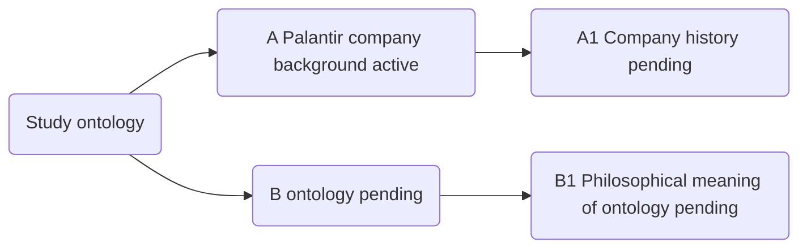

# Trailmap Lite Usage

[中文](USAGE.zh-CN.md) | [Product overview](../README.md)

Trailmap Lite does one thing: it records the paths that appear while you work with an agent, so you can remember, switch, and review them later. It does not analyze the work inside a path, inspect business code, or suggest debugging steps.

Use `$trailmap` in Codex and `/trailmap` in Claude Code. The examples below use `$trailmap`.

## Quick Command Overview

You can now use Trailmap through the `/trailmap` command. Main commands:

| Command | Purpose |
| --- | --- |
| `/trailmap new <title> --id <id>` | Create a new Topic |
| `/trailmap pending <title>` | Add a path to explore |
| `/trailmap resume <key>` | Resume a path |
| `/trailmap close <key> <done\|blocked\|discarded>` | Close a path |
| `/trailmap map` | Show the path map |
| `/trailmap list` | List all paths |

## 1. Core Model

A chat usually maps to one Topic. A Topic contains multiple Paths. Each Path has a key, title, state, and notes.

Common states:

```text
active   the current path; at most one per Topic
pending  a path to revisit later
paused   a paused path
closed   a closed path, classified as done / blocked / discarded
```

Example:

```text
Topic: study-ontology | Study ontology
active: A Palantir company background
pending: A1 Company history
pending: B ontology
pending: B1 Philosophical meaning of ontology
pending: C Add knowledge graph background
pending: D Data modeling and SQL
```

`A`, `B`, and `C` are root paths. `A1` is a child of `A`; `B1` is a child of `B`.

## 2. Topic Selection

Every selected-Topic response starts with:

```text
Topic: <id> | <title>
```

Trailmap uses the latest valid Topic marker in the current chat to choose the current Topic.

- No Topic exists: create one.
- Exactly one Topic exists and the current chat has no marker: Trailmap selects it.
- Multiple Topics exist and the current chat has no marker: Trailmap lists IDs and titles and requires `use <id>`.
- Resumed chat: the latest Topic marker restores selection.
- New chat using an old Topic: run `use <topic-id>`.

```text
$trailmap use study-ontology
```

`list all` is the read-only exception: it can list all Topic summaries without selecting a Topic.

## 3. Creating a Topic

Explicit creation:

```text
$trailmap new Study ontology --id study-ontology
```

Without `--id`, Trailmap derives a short ASCII slug from the title. Topic IDs and filenames do not change after creation.

If you first enter a multi-path command but no Topic exists yet, Trailmap asks for a Topic title. Your next reply can be only the title:

```text
$trailmap Study ontology, direction one is Palantir company background  direction two is ontology
```

After Trailmap asks for the Topic title:

```text
Study ontology
```

Trailmap creates the Topic and records the paths:

```text
Topic: study-ontology | Study ontology
active: A Palantir company background
pending: B ontology
```

This plain Topic-title reply is a one-time exception that only applies immediately after Trailmap asks for a Topic title. Ordinary conversation does not trigger Trailmap.

## 4. Recording Multiple Paths

When a Topic is selected, text after `$trailmap` may directly list two or more explicit paths:

```text
$trailmap Study ontology, direction one is Palantir company background  direction two is ontology
```

Trailmap only extracts and records path titles. It does not explain or analyze them. List markers such as `direction one is`, `direction two is`, `one is`, and `another is` are treated as separators; the stored path title is the actual title text.

In an empty Topic, the first path becomes `active` and the rest become `pending`:

```text
active: A Palantir company background
pending: B ontology
```

In a nonempty Topic, the shortcut adds pending paths and keeps the current active path unchanged:

```text
$trailmap Add two directions: LLM fundamentals, permission model
```

Possible result:

```text
pending: E LLM fundamentals
pending: F permission model
```

If the text cannot be split into two or more clear paths, Trailmap writes nothing and asks for explicit `pending <title>` commands.

## 5. Adding One Path

### Add a Sibling

```text
$trailmap pending Add knowledge graph background
```

If the current active path is root `A`, this creates a pending sibling by default:

```text
active: A Palantir company background
pending: B ontology
pending: C Add knowledge graph background
```

### Add a Child

```text
$trailmap pending Company history --child
```

`--child` attaches the new path under the current active path:

```text
active: A Palantir company background
pending: A1 Company history
pending: B ontology
pending: C Add knowledge graph background
```

### Choose a Key

```text
$trailmap pending Data modeling and SQL --key D
```

Result:

```text
pending: D Data modeling and SQL
```

Keys are unique within a Topic and do not change after creation.

### Choose a Parent

```text
$trailmap pending Philosophical meaning of ontology --parent B
```

Result:

```text
pending: B1 Philosophical meaning of ontology
```

`--child` and `--parent <key>` cannot be combined.

## 6. Viewing Paths

### `list`

```text
$trailmap
$trailmap list
```

Calling Trailmap with no subcommand is equivalent to `list`. `list` shows paths in tree order: each parent is followed by its descendants before the next sibling. It does not group all active, pending, paused, or closed paths into separate state buckets.

Example:

```text
Topic: study-ontology | Study ontology
active: A Palantir company background
pending: A1 Company history
pending: B ontology
pending: B1 Philosophical meaning of ontology
pending: C Add knowledge graph background
pending: D Data modeling and SQL
```

### `show`

```text
$trailmap show
$trailmap show B
```

`show` displays the current active path. If none is active, it displays a Topic summary. `show <key>` displays that path's title, parent, status, note, updates, and closure fields.

### `list all`

```text
$trailmap list all
```

Shows all Topic IDs, titles, active keys, and path counts. It does not expand every Topic and does not change the current selection.

## 7. Updating Path Notes

### Update the Current Active Path

```text
$trailmap update Consulting for government
```

If `Consulting` is not an existing path key, the full text after `update` is stored as a note on the current active path. The path state does not change.

### Update a Specific Key

```text
$trailmap update A Consulting for government
```

If `A` exactly matches an existing path key, the note is stored on A.

### Pause the Current Active Path

```text
$trailmap update Waiting for more material --pause
$trailmap update A Waiting for more material --pause
```

`--pause` can only target the current active path. On success, the path becomes `paused` and `topic.active` becomes `null`.

If no note is supplied:

```text
$trailmap update
$trailmap update A
```

Trailmap drafts one short note from the current chat and prints a complete `$trailmap update <key> <draft>` command. It writes nothing this time. A bare confirmation does not persist the note.

## 8. Resuming a Path

```text
$trailmap resume B
```

Only `pending` or `paused` paths can be resumed normally. The old active path becomes `paused`, the target becomes `active`.

Optionally leave a note on the old active path:

```text
$trailmap resume B --note "A has basic company background covered"
```

If the target path is closed, plain resume does not write. It only prints an explicit reopen command:

```text
resume B --reopen --note "<reason>"
```

Reopen requires a nonempty reason.

## 9. Closing a Path

### Close the Current Active Path

```text
$trailmap close done Company background is understood
```

If the first argument is `done`, `blocked`, or `discarded`, Trailmap closes the current active path.

### Close a Specific Key

```text
$trailmap close A done Company background is understood
$trailmap close B blocked Waiting for material
$trailmap close C discarded No longer needed
```

Closing preserves the path and its update history. It changes the state and records classification, reason, and time. Closing the active path sets `topic.active` to `null` and never activates another path automatically.

If no reason is supplied, Trailmap records `未填写关闭原因`; it does not infer one.

## 10. Renaming a Path Title

### Rename the Current Active Path

```text
$trailmap rename New path title
```

### Rename a Specific Path

```text
$trailmap rename A New path title
```

`rename` only changes the path title. It does not change the Topic title, Topic ID, filename, path key, parent, status, note, or updates.

## 11. Mind Map

### Mermaid graph

```text
$trailmap map
```

Outputs Mermaid `graph LR` from parent relationships:


```mermaid
graph LR
  root("Study ontology") --> A("A Palantir company background active") & B("B ontology pending")
  A --> A1("A1 Company history pending")
  B --> B1("B1 Philosophical meaning of ontology pending")
```

### Plain Text Tree

```text
$trailmap map text
```

Outputs the same structure as a plain-text tree.

## 12. Storage

Trailmap data lives in the current workspace:

```text
.trailmap/
  topics/
    study-ontology.json
```

A Topic file roughly looks like:

```json
{
  "id": "study-ontology",
  "title": "Study ontology",
  "active": "A",
  "paths": [
    {
      "key": "A",
      "title": "Palantir company background",
      "status": "active",
      "parent": null,
      "note": "",
      "updates": []
    }
  ]
}
```

Another generic example:

```json
{
  "id": "login-failure",
  "title": "Login failure investigation",
  "active": "A",
  "paths": [
    {
      "key": "A",
      "title": "Check token refresh",
      "status": "active",
      "parent": null,
      "note": "",
      "updates": []
    }
  ]
}
```

Each Topic is stored independently. Trailmap does not create `index.json` and does not store a global active Topic.

## 13. Output and Safety Rules

- The Topic marker is always first.
- Successful writes normally output one result line.
- Read commands expand only the requested records.
- Trailmap does not output solution advice or promise to continue executing a path.
- Trailmap does not dump full JSON.
- Trailmap does not modify business code or Git.
- Before writing the same Topic, Trailmap rereads the file and uses SHA-256 for best-effort conflict detection. This is not an atomic lock; avoid simultaneous writes to the same Topic.

## 14. Unsupported Operations

Trailmap Lite has no delete command. To remove an open path from work while preserving history, close it:

```text
$trailmap close A discarded No longer needed
```

Legacy `mark` prefixes, clean/informed modes, subagent, and worktree execution are not part of Trailmap Lite.
