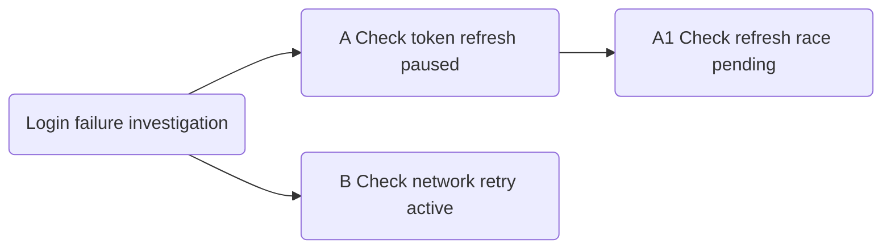

# Trailmap Lite Usage

[中文](USAGE.zh-CN.md) | [Product overview](../README.md)

## 1. Boundary

Trailmap runs only when explicitly invoked as `$trailmap` in Codex or `/trailmap` in Claude Code. It records and displays paths; it does not work on the underlying problem.

While handling a Trailmap command, the agent must not inspect business code or Git, request diagnostic data, generate a solution plan, suggest next debugging steps, or continue executing a path. Once the command response is complete, normal agent behavior resumes.

## 2. Topic Selection

Every selected-Topic response starts with:

```text
Topic: <id> | <title>
```

The current chat uses its latest valid Topic marker.

- No Topics: Trailmap asks for `new <title>`.
- Exactly one Topic and no marker: Trailmap selects it.
- Multiple Topics and no marker: Trailmap lists IDs and titles and requires `use <id>`.
- Resumed chat: the latest marker restores the selection.
- New chat: use `use <id>` to select a Topic created elsewhere.

Selection is not stored globally, so separate chats can use different Topics without changing one another.

## 3. Storage

```text
.trailmap/
  topics/
    login-failure.json
    billing-timeout.json
```

A Topic file contains:

```json
{
  "id": "login-failure",
  "title": "Login failure investigation",
  "active": "A",
  "paths": [
    {
      "key": "A",
      "title": "Check token refresh",
      "status": "active",
      "parent": null,
      "note": "",
      "updates": []
    }
  ]
}
```

Allowed path states are `active`, `pending`, `paused`, and `closed`. A Topic has at most one active path, and `topic.active` must contain its key or `null`.

Closed paths also contain:

```json
{
  "closed_as": "discarded",
  "closed_reason": "Not the source of the 401 response",
  "closed_at": "2026-07-02T10:30:00+08:00"
}
```

Valid closing classifications are `done`, `blocked`, and `discarded`.

## 4. Commands

### `new <topic-title> [--id <id>]`

Create and select an empty Topic.

```text
$trailmap new Login failure investigation --id login-failure
```

IDs are immutable ASCII slugs matching `^[a-z0-9]+(?:-[a-z0-9]+)*$`. Without `--id`, Trailmap derives a short meaningful slug, translating or transliterating non-ASCII titles when needed, and adds `-2`, `-3`, and so on for collisions. It never overwrites an existing Topic.

### `use <topic-id>`

Select an existing Topic for the current chat without modifying its file.

```text
$trailmap use login-failure
```

### `pending <title>`

Record a path without changing the current active path.

```text
$trailmap pending Check network retry
$trailmap pending Check clock skew --key A2 --note "Low confidence" --child
$trailmap pending Compare retry limits --parent B
```

Rules:

- The title and optional note are stored verbatim.
- Trailmap chooses a short unique key unless `--key` is supplied.
- The first path in an empty Topic becomes a root `active` path.
- With an active path, the default is a `pending` sibling with the same parent.
- `--child` creates a pending child of the active path.
- `--parent <key>` creates a pending child of that existing path.
- `--child` and `--parent` cannot be combined.
- With no active path, the default is a root pending path; `--child` is invalid.

### `list` and `list all`

`list` shows every path in the selected Topic, grouped by state. Calling Trailmap with no arguments is equivalent.

```text
$trailmap
$trailmap list
```

`list all` shows one compact summary per Topic: ID, title, active key, and path counts. It does not select another Topic or expand every path.

```text
$trailmap list all
```

### `show [key]`

`show` displays the current active path. If none is active, it displays a concise Topic summary. `show <key>` displays that exact path's title, parent, state, note, updates, and closure fields.

```text
$trailmap show
$trailmap show B
```

### `update <key> [note] [--pause]`

Append the supplied note without changing path status:

```text
$trailmap update A Token expiry has been ruled out
```

Trailmap stores the note exactly and does not inspect files or Git.

If no note is supplied, Trailmap may compress the current chat into one short draft. It must show that draft and wait for confirmation before writing.

Pause only the current active path:

```text
$trailmap update A Waiting for production logs --pause
```

This sets A to `paused` and `topic.active` to `null`. `--pause` is rejected for pending, paused, closed, or non-current paths.

### `resume <key> [--note <note>]`

Switch from the current active path to a pending or paused path:

```text
$trailmap resume B
$trailmap resume B --note "A is waiting for logs"
```

The old active path becomes paused, the target becomes active, and `topic.active` changes to the target key. Trailmap does not generate a leave summary. An explicit `--note` is stored on the old active path only.

The response shows the target title, note, and up to three recent updates, then stops without executing the path.

For a closed target, plain `resume B` performs no write and prints the classification, reason, and:

```text
resume B --reopen --note "<reopen reason>"
```

Reopening requires a nonempty reason. The old active path becomes paused, B becomes active, the old closure remains in B's update history, and B's top-level closure fields are removed.

### `close <key> <classification> [reason]`

```text
$trailmap close A done Verified by the regression test
$trailmap close B blocked Waiting for vendor logs
$trailmap close C discarded Hypothesis disproved
```

Closing appends a historical update and preserves the path. When no reason is supplied, Trailmap records `未填写关闭原因`; it does not infer one. Closing the active path sets `topic.active` to `null` and never activates another path automatically.

### `rename <topic-title>`

Change only the selected Topic title:

```text
$trailmap rename Login incident follow-up
```

The Topic ID, filename, path keys, and path titles remain unchanged.

### `map [text]`

`map` outputs a Mermaid `graph LR` generated from parent references. Internal Mermaid node IDs are sanitized when a path key contains unsupported characters; labels retain the original key:

```text
$trailmap map
```


```mermaid
graph LR
  root("Login failure investigation") --> A("A Check token refresh paused") & B("B Check network retry active")
  A --> A1("A1 Check refresh race pending")
```

`map text` outputs the same hierarchy as plain text.

## 5. Output Rules

- Topic marker first.
- Successful writes normally add one result line.
- Read commands expand only the requested records.
- `resume` may additionally display the target's existing record.
- Errors, closed paths, and conflicts add only the instruction needed to recover.
- No solution advice, execution promises, full JSON dumps, or unsolicited tutorials.

## 6. Confirmation Rules

Explicit, valid commands write immediately. Confirmation is required only when Trailmap generates an `update <key>` note because the user supplied no note, or when input is genuinely ambiguous. Invalid commands never write.

## 7. Concurrency

Each write rereads the Topic immediately before replacement and compares its SHA-256 with the initial read. A mismatch rejects the write and asks the user to retry.

This is best-effort conflict detection, not atomic locking. Two writers can still overwrite one another if both verify the same hash before either replacement. Avoid simultaneous writes to the same Topic. Different Topics use independent files and do not conflict.

## 8. Unsupported Operations

Trailmap Lite has no delete command and does not reinterpret legacy or unknown syntax. Use `close <key> discarded [reason]` to retain a path while removing it from open work. Edit or remove a Topic file manually only when intentional.
