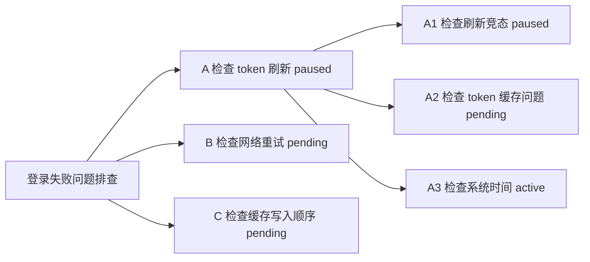

# Trailmap 详细使用说明

[产品介绍](../README.zh-CN.md) · [English usage guide](USAGE.md)

Trailmap 在 workspace 中记录决策点和探索路径。本说明覆盖完整命令行为；[`trailmap/SKILL.md`](../trailmap/SKILL.md) 是行为定义的事实来源。

## 核心概念

### 主题 Topic

主题是一条可独立追踪的问题或工作线，例如“登录超时排查”。主题不与 chat 一一对应：一个 chat 可以包含多个主题，一个主题也可以跨多个 chat 继续。

### 路径 Path

路径表示一个具体探索方向。每条路径只有一个唯一 `key`，例如 `A`、`B`、`A1` 或 `P2`。`key` 既是人类可见的短标识，也是内部唯一引用标识。它在主题内必须唯一，v1 不支持重命名路径 key。

### 父路径 Parent

路径通过父路径形成树。根路径的 `parent` 是 `null`；child path 的 `parent` 保存父路径的 `key`。Trailmap 根据这些引用推导树，不保存 `children` 数组。

### 活跃路径 Active Path

活跃路径是当前正在探索的方向。每个主题最多只有一条 active path。主题的 `active` 字段保存这条路径的 `key`；没有活跃路径时为 `null`。

### 来源上下文 Created From

来源上下文记录路径为什么被创建，以及分叉点当时已经确认的事实、假设和约束。`resume clean` 用它重建目标路径的起点，避免自动带入 sibling paths 的详细推理过程。

## 安装与调用

将仓库中的 `trailmap/` 目录安装为 Agent Skill。Codex 和 Claude Code 的安装命令见[产品介绍](../README.zh-CN.md#安装)。

Codex 调用方式：

```text
$trailmap <subcommand>
```

Claude Code 调用方式：

```text
/trailmap <subcommand>
```

显式调用后的参数直接作为子命令解析。以下示例使用 Codex 语法；Claude Code 用户将 `$trailmap` 替换为 `/trailmap` 即可。

## 命令总览

```text
$trailmap
$trailmap pending <idea>
$trailmap list
$trailmap show [key]
$trailmap update <key>
$trailmap subagent <key>
$trailmap subagent <key> --worktree
$trailmap subagent <key> --worktree --base <ref>
$trailmap resume <key> clean|informed
$trailmap resume <topic_id> <key> clean|informed
$trailmap close <key> done|blocked|discarded
$trailmap rename <topic title>
$trailmap map [text]
```

## 创建路径

### 创建根路径或 child paths

使用基础命令并用自然语言说明分叉：

```text
$trailmap 登录失败可能来自 token 刷新或网络重试，先检查 token 刷新。
```

```text
A  Token 刷新排查  [active]
B  网络重试  [pending]
```

结果：生成 A、B 路径。路径图可以用 `$trailmap map` 查看。

默认由 AI 生成简短且唯一的 key，根路径通常使用 `A/B/C`，child paths 通常使用 `A1/A2`。也可以明确指定 `P1/P2` 等 key；Trailmap 会查重，不会覆盖已有路径。

如果当前没有活跃主题，Trailmap 会草拟新主题和根路径。根路径使用 `parent: null`；其中一条成为 `active`，其他路径成为 `pending`。

如果希望为新建的非 active 路径启动 subagent 探索，可以追加 `--subagent`：

```text
$trailmap 登录失败可能来自 token 或网络，先查 token --subagent B --allow-shared-code
$trailmap 登录失败可能来自 token、网络或缓存，先查 token --subagent B,C --worktree
```

### 新增子方向路径

如果已经存在活跃主题和活跃路径，基础命令表示“当前路径内部又分出了子方向”。确认后，Trailmap 会：

1. 为当前路径追加离开摘要
2. 将当前路径从 `active` 改为 `paused`
3. 创建 child paths，并把它们的 `parent` 设为原 active path 的 `key`
4. 选择一条 child path 作为 `active`，其余设为 `pending`
5. 将 `topic.active` 更新为新 active child 的 key

示例：

```text
$trailmap A 内部可能是缓存问题，也可能是刷新竞态，先查刷新竞态。
```

```text
A  Token 刷新排查  [paused]
├─ A1  刷新竞态    [active]
└─ A2  缓存不一致  [pending]
B  网络重试  [pending]
```

结果：从 A 生成 A1、A2 路径。

### 原地新增 sibling pending 路径（兄弟路径）

当你想到另一个可能性，但希望完全保持当前工作路径不变时，使用：

新路径会：

1. 使用与当前 active path 相同的 `parent`，因此是 sibling path
2. 初始状态设为 `pending`
3. 不生成当前路径的离开摘要
4. 不改变当前路径的 `active` 状态
5. 完全保持 `topic.active` 不变

如果当前 `A` 是 active：

```text
$trailmap pending 可能是系统时间偏差导致，先记下来，不切换。
```

```text
A  Token 刷新排查  [active]
B  网络重试        [pending]
C  系统时间偏差    [pending]
```

结果：生成 C 路径，且 A 仍然是 active。

如果当前 `A1` 是 active：

```text
$trailmap pending 可能是缓存写入顺序导致，先记下来，不切换。
```

```text
A  Token 刷新排查  [paused]
├─ A1  刷新竞态        [active]
├─ A2  缓存不一致      [pending]
└─ A3  缓存写入顺序    [pending]
B  网络重试            [pending]
```

结果：生成 A3 路径，且 A1 仍然是 active。也就是说，`pending` 永远把新路径挂在当前 active path 的旁边，而不是挂在整个主题根部。

> [!NOTE]
>
> 如果表达的是“当前路径内部出现子分叉”，应使用基础命令，而不是 `pending`。

也可以为新建的 sibling pending 路径启动 subagent 探索：

```text
$trailmap pending 网络重试可能是主因 --subagent --allow-shared-code
```

新路径仍然是 `pending`；subagent 进展单独记录在 `agent_run`。

### 查看所有主题

```text
$trailmap list
```

`list` 是跨主题的 workspace 工作台。它按以下状态展示每个主题的路径：

```text
active
pending
paused
closed
```

active、pending 和 paused 路径显示 key、标题以及必要的代码改动提醒。带 subagent 状态的路径会追加紧凑执行状态，例如 `[pending, subagent running]`。closed 路径还会显示 `closed_as` 和 `closed_reason`，但不会展开完整 updates。

对于 worktree subagent run，`list` 只显示紧凑 worktree 状态，例如 `[pending, subagent running, worktree]`。

### 查看主题或路径详情

```text
$trailmap show
```

不带 key 时，`show` 展示活跃主题、当前 active path、active path 的最近更新、pending 和 paused 备选路径，以及 closed 路径的关闭原因。

```text
$trailmap show B
```

`show [key]` 只在活跃主题内查找并展示一条路径，包括它的 `created_from`、路径说明、完整 updates、代码改动详情、最近一次 `agent_run` 字段、可用的 subagent handoff/report 摘要和关闭字段。

对于 worktree subagent run，`show <key>` 还会展开 worktree path、worktree branch、base ref、base sha、创建 worktree 时主工作区是否 dirty、changed files 和 diff summary。

v1 不支持 `show <topic_id>`。可以用 `list` 查找主题，再通过跨主题 `resume` 激活目标路径。

### 更新路径进展

```text
$trailmap update <key>
```

Trailmap 会生成结构化更新草案：

```text
time
summary
conclusion
status_after
closed_as, only when status_after=closed
codechange.changed
codechange.files
codechange.summary
```

默认的简洁确认草案只展示路径 key、摘要、结论、更新后状态和相关代码改动。明确确认后，更新会追加到路径的 `updates`，并同步路径顶层状态。

当 `status_after` 是 `closed` 时，Trailmap 同时记录关闭字段；路径不是 closed 时，顶层关闭字段必须不存在。

### 为已有路径启动 subagent 探索

```text
$trailmap subagent <key>
$trailmap subagent B
$trailmap subagent B --informed --allow-shared-code
$trailmap subagent B --worktree
$trailmap subagent B --worktree --informed
$trailmap subagent B --worktree --base origin/main
```

`subagent <key>` 为活跃主题中的已有路径启动 subagent 探索。目标路径必须存在，不能是当前主会话 active path，不能是 closed，且不能已经有 `agent_run.status: running`。

Trailmap 会保持主会话 active path 不变。目标路径保留自己的生命周期状态，通常是 `pending` 或 `paused`，同时获得执行层状态：

```text
B  网络重试  [pending, subagent running]
```

默认情况下，Trailmap 会在启动 subagent 前提示共享工作区风险。这个提示的原因是 subagent 和主会话 active path 可能同时修改同一批文件。`--allow-shared-code` 表示接受这个风险，并跳过共享代码风险的二次提示，但它不跳过 Trailmap 写入确认。

如果当前运行环境没有可用的 subagent 工具，Trailmap 不应让路径操作失败。确认后记录 `agent_run.status: blocked` 和简短原因。

### 在 worktree 中运行 subagent

worktree 是显式 opt-in。某条 subagent path 可能修改代码、且你希望它不要影响主会话 active path 时，使用 `--worktree`：

```text
$trailmap subagent B --worktree
$trailmap subagent B --worktree --informed
$trailmap subagent B --worktree --base origin/main
```

`--worktree` 和 `--allow-shared-code` 互斥。接受文件级相互影响风险时使用共享工作区；希望使用独立本地 Git worktree 时使用 `--worktree`。

base 默认是 `HEAD`。`--base <ref>` 可以覆盖它。如果 `--base <ref>` 无法解析，Trailmap 会阻塞这次 subagent run，不会 fallback 到 `HEAD`。

默认 worktree 位置为：

```text
.worktrees/trailmap/<topic-id>/<path-key>/
trailmap/<topic-id>/<path-key>   # branch
```

如果目录非空或 branch 已存在，Trailmap 会为 worktree path 和 worktree branch 追加相同的唯一后缀。不会复用已有非空目录或已有 branch。

主工作区未提交改动不会复制到 worktree。创建 worktree 时如果主工作区有未提交改动，Trailmap 记录 `base_dirty: true`。

### worktree 确认草案与安全边界

创建 worktree 前，Trailmap 会展示确认草案，包括 path、context mode、base ref 和 sha、将创建的 branch、worktree path、主工作区是否有未提交改动、是否会更新 `.gitignore`，以及安全提示。

创建项目内 worktree 前，`.worktrees/` 必须被忽略。如果尚未忽略，Trailmap 可以在确认后只向 `.gitignore` 追加这一行：

```text
.worktrees/
```

Trailmap 不会自动 merge、commit、清理或应用 worktree 改动，也不会 stash、revert、复制文件或切换主工作区 branch。

### worktree 结果

worktree run 的 subagent report 还需要包含：

```text
worktree.path
worktree.branch
worktree.base_ref
worktree.base_sha
worktree.changed_files
worktree.diff_summary
```

Trailmap 从 worktree 相对 `agent_run.worktree.base_sha` 的 diff 中推导 `codechange.files`，而不是从主工作区推导。如果 diff 无法读取，则记录 `changed: true`、空文件列表，并写入 `Worktree diff unavailable; inspect worktree manually.`

worktree subagent 返回后，Trailmap 默认保留它作为 retained worktree，并记录 `agent_run.worktree.status: retained`。第一个 worktree 版本不会自动删除 worktrees。

### 为新建路径启动 subagent 探索

subagent 启动也可以附着到新建的非主 active 路径：

```text
$trailmap pending 网络重试可能是主因 --subagent --allow-shared-code
$trailmap 登录失败可能来自 token 或网络，先查 token --subagent B --allow-shared-code
$trailmap 登录失败可能来自 token、网络或缓存，先查 token --subagent B,C --allow-shared-code
$trailmap pending 网络重试可能是主因 --subagent --worktree
$trailmap 登录失败可能来自 token、网络或缓存，先查 token --subagent B,C --worktree
```

当一个命令创建了非主 active 路径且没有 `--subagent` 标志时，Trailmap 会询问是否为 0 条、1 条或多条候选路径启动 subagent 探索。如果使用了 `--subagent B,C`，则直接选择这些 key。

`--allow-shared-code` 是风险接受参数，不是写入确认绕过参数。Trailmap 仍然会展示新路径和 `agent_run` 草案，并等待明确确认后才写入状态。

### subagent 上下文模式

subagent 上下文默认使用 `clean`。clean 上下文包含主题标题、目标路径的 `created_from`、目标路径说明、目标路径 updates、当前 active path 的最小身份信息、共享工作区风险和固定报告格式。它不包含 sibling paths 的详细推理过程。

当希望 subagent 参考 sibling、parent、当前 active 或此前已探索路径的摘要结论时，使用 `--informed`。Trailmap 会把这些内容标记为“其他路径上下文”。

### subagent 报告

subagent 返回固定报告：

```text
path_key
summary
conclusion
status_after
closed_as, only when status_after=closed
codechange.changed
codechange.files
codechange.summary
handoff
```

subagent 返回后，Trailmap 会把这次 run 记录或展示为 `reported`，并把报告转换成正常的 `update <key>` 草案。必须由你确认后，Trailmap 才会写入 update、改变路径状态、写入关闭字段，或将 `agent_run.status` 标记为 `completed`。

如果你拒绝 update 草案，Trailmap 不写入 update，不处理代码，并保持 `agent_run.status` 为 `reported`。

subagent 可以建议 `status_after: closed` 和 `closed_as`，但不能直接关闭路径。

### 使用 clean 或 informed 回溯路径

在当前主题内切换路径：

```text
$trailmap resume <key> clean|informed
```

同时切换主题和路径：

```text
$trailmap resume <topic_id> <key> clean|informed
```

切换前，Trailmap 会为当前活跃路径草拟离开摘要，并默认将它改为 `paused`。确认草案会显示目标路径、所选模式、状态变化和代码改动警告。明确确认后，目标路径变为 `active`，`topic.active` 更新为目标 key；跨主题 resume 还会更新 `index.active_topic_id`。

如果目标路径已经 closed，Trailmap 会警告本次操作将重新打开路径，并要求明确确认。重开后会追加一条 update，并移除顶层 `closed_as`、`closed_reason` 和 `closed_at`；历史关闭记录仍保留在 `updates` 中。

如果目标路径正在被 subagent 探索，Trailmap 会提示在主会话 resume 这条路径可能造成重复工作或上下文混合。这个提示不会阻止 resume。

### resume 带 retained worktree 改动的路径

如果目标路径有 retained worktree，并且存在 changed files 或 diff summary，Trailmap 会提示这些代码改动尚未合并到当前工作区。`resume clean` 可以包含目标路径自己的 worktree artifact summary，但不会应用这些改动，也不会带入未经确认的完整 handoff reasoning。

#### clean

`clean` 只包含：

- 目标路径的 `created_from`
- 目标路径自己的 title、goal 和 hypothesis
- 目标路径自己的 updates
- 创建时记录的 constraints
- 已记录或当前代码改动的警告

它不会带入 sibling paths 的详细推理过程。适合在 A 的结论可能干扰 B 时，尽量从 B 的原始分叉点重新判断。

#### informed

`informed` 包含 clean 的全部内容，并额外带入 sibling、parent 或其他已探索路径的摘要结论。这部分内容会被明确标记为“其他路径上下文”，方便识别来源。

两种模式都不会改变 Git 状态，也不会隔离工作区文件。`clean` 表示对话上下文相对干净，不代表 checkout 或工作区干净。

### 关闭路径

```text
$trailmap close <key> done|blocked|discarded
```

关闭时必须选择一种分类：

```text
done       已完成、已证实或已解决
blocked    当前条件下无法继续
discarded  已排除、无效或决定放弃
```

Trailmap 会草拟 key、`closed_as`、关闭原因、最终摘要和相关代码改动。明确确认后，它会追加 closing update，将路径状态设为 `closed`，并写入 `closed_as`、`closed_reason` 和 `closed_at`。

如果被关闭的是 active path，`topic.active` 会变为 `null`。Trailmap 不会自动激活下一条路径；需要显式执行 `resume`。

### 重命名活跃主题

```text
$trailmap rename <topic title>
```

确认后只修改当前活跃主题的标题，不重命名 path key 或路径标题。

### 生成 Mermaid 或文本路径图

```text
$trailmap map
```

示例输出：



`map` 默认输出当前主题的 Mermaid `graph LR`。它根据 `paths[].parent` 推导图，展示 key、标题、状态、closed 路径的 `closed_as`，以及可用的紧凑 subagent 状态，不展示完整 updates。

对于 worktree subagent run，`map` 只显示紧凑 worktree 状态，例如 `pending / subagent running / worktree`。

```text
$trailmap map text
• 登录失败问题排查
  ├─ A 检查 token 刷新 [paused]
  │  ├─ A1 检查刷新竞态 [active]
  │  ├─ A2 检查 token 缓存问题 [pending]
  │  └─ A3 检查系统时间 [closed: discarded]
  ├─ B 检查网络重试 [pending]
  └─ C 检查缓存写入顺序 [pending]
```

`map text` 使用纯文本树展示相同信息。

三个只读视图的职责不同：

- `list`：跨主题状态工作台
- `show`：活跃主题或单条路径详情
- `map`：活跃主题的树状结构

## 简洁确认草案

每个写操作都会先在内部生成完整结构化草案，再向用户展示简洁确认视图。默认视图只包含与决策相关的标识、标题、目标或摘要、最终状态、必要警告，以及末尾一个明确确认问题。

默认不展示时间戳、`source`、`created_from`、`parent`、重复状态列表和完整持久化结构。遇到 key 或 parent 关系歧义、重开 closed 路径、代码改动可能污染 clean resume，或者用户要求查看详情时，Trailmap 会展开相关字段。

没有得到明确确认前，不会写入状态。

需要确认的写操作：

```text
基础命令
pending
update
resume
close
rename
```

不需要确认的只读操作：

```text
list
show
map
```

## JSON 写入安全

Trailmap topic 文件里，很多 path 都有相同字段名，例如 `status`、`updates`、`closed_as` 和 `closed_reason`。Agent 不应使用松散文本上下文直接 patch 这些重复字段。

推荐写入顺序：

1. 解析 topic JSON
2. 用精确的 `paths[].key` 定位目标路径
3. 写入前 snapshot statuses for all paths
4. 只修改目标 path object 和明确需要修改的 topic 字段
5. 序列化 JSON
6. 写入后验证 invariants

如果必须手动 textual patch，同一个 hunk 的上下文必须包含目标路径唯一的 `"key"` 和 `"title"`。当多个 path 都有同名字段时，不要只 patch 裸 `"status"` 行。

每次写入后都要验证：目标 path 已变成预期状态、没有 unintended sibling or parent path changed status、closed 路径具备 `closed_as`、`closed_reason`、`closed_at`，并且最后一条 update 的 `status_after` 是 `"closed"`。

## 数据模型

Trailmap 使用带 parent 引用的扁平 `paths` 列表：

```json
{
  "id": "login-timeout",
  "title": "登录超时排查",
  "active": "A",
  "source": "2026-06-22 当前会话",
  "paths": [
    {
      "key": "A",
      "title": "检查 token 过期",
      "status": "active",
      "parent": null,
      "created_from": {
        "reason": "超时可能来自 token 刷新或网络重试。",
        "confirmed": ["接口返回 401"],
        "assumptions": ["可能是 token 刷新失败"],
        "constraints": ["不自动回滚代码"]
      },
      "goal": "验证是否由 token 过期导致超时",
      "hypothesis": "Refresh Token 没有成功续期",
      "updates": []
    }
  ]
}
```

路径状态只能是 `active`、`pending`、`paused` 或 `closed`。closed 路径还必须具有 `closed_as: done|blocked|discarded`。

模型不变量：

- `topic.active` 只能是 `null` 或当前 active path 的 key。
- `topic.active` 不为 `null` 时，必须恰好有一条路径的 `status` 是 `active`，并且 key 与它一致。
- 所有路径都 closed 时，`topic.active` 必须是 `null`。
- 主题是否 open 由路径状态推导，不保存 `topic.status`。
- `source` 是可选的人类可读上下文，不能依赖平台 conversation ID。
- `closed_as`、`closed_reason` 和 `closed_at` 只存在于 closed 路径。重开路径时移除这些顶层字段，但关闭历史保留在 `updates` 中。

路径 update 使用：

```json
{
  "time": "2026-06-22T10:30:00+08:00",
  "summary": "检查了 token TTL 和刷新逻辑。",
  "conclusion": "暂未发现刷新失败证据。",
  "status_after": "paused",
  "codechange": {
    "changed": false,
    "files": [],
    "summary": "只读排查，没有修改代码。"
  }
}
```

## 数据保存位置

新 workspace 默认使用：

```text
.trailmap/marks/
  index.json
  <topic-id>.json
```

`index.json` 保存 `active_topic_id` 和最近主题 ID。每个 topic 文件保存一条独立工作线。如果 workspace 已经存在 `.codex/marks/`，Trailmap 会继续使用旧目录保持兼容，除非用户明确要求迁移。

## 代码改动与 Git 安全

Trailmap 只把代码改动记录为提醒和检查清单。subagent 探索可能和主会话 active path 在同一个共享工作区中运行。Trailmap 会提示共享工作区代码风险，但绝不会自动：

- stash 改动
- revert 文件
- commit 代码
- 创建或切换 Git 分支
- 回滚另一条路径产生的工作

执行 `resume clean` 前，应检查当前工作区改动是否属于即将离开的路径。Trailmap 可以提示污染风险，但不会修改文件。

## 推荐工作流

1. 遇到多个根方向时，用基础命令创建主题和根路径。
2. 当前路径内部再次分叉时，用基础命令创建 child paths。
3. 临时想到同级备选方向时，用 `pending` 原地记录，不切换 active。
4. 完成一次关键实验或得到阶段结论后，用 `update` 记录进展。
5. 希望尽量避免其他路径影响时，用 `resume <key> clean`。
6. 希望参考其他路径结论时，用 `resume <key> informed`。
7. 路径结束时，用 `close` 和 `done`、`blocked` 或 `discarded` 分类关闭。
8. 分别用 `list`、`show` 和 `map` 查看工作台、详情和树结构。

## 完整示例

```text
$trailmap 登录超时可能来自 token 刷新或网络重试，先检查 token 刷新。
```

确认草案后，A 为 active，B 为 pending。

```text
$trailmap pending 可能是服务端限流，先记下来，不切换当前路径。
$trailmap update A Token TTL 和刷新逻辑正常，没有改代码，暂停 A。
$trailmap resume B clean
```

完成 B 的探索后：

```text
$trailmap close B done
$trailmap map
```

每个写命令都会先展示草案。`map` 是只读操作，可以把结果复制到 issue、Notion 或设计文档。

## 当前限制

- Trailmap 记录决策点和路径级 updates，不保存每轮聊天。
- 数据模型通过 `parent` 表达树，不处理通用图关系。
- v1 不支持 `show <topic_id>`。
- Notion 目前通过 Mermaid 或文本手动导出。
- Trailmap 会报告 Git 风险，但不会自动管理 Git 状态。
