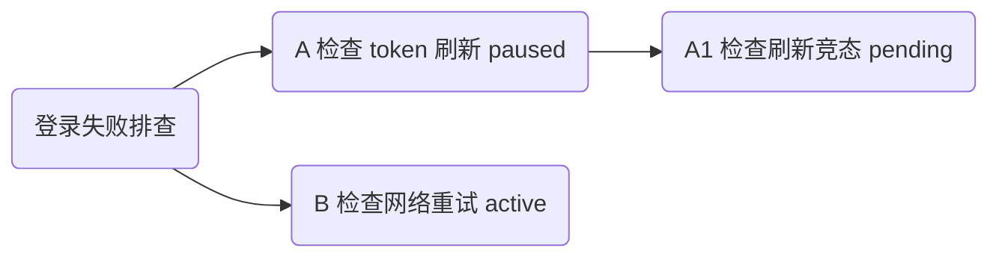

# Trailmap Lite 使用说明

[English](USAGE.md) | [产品介绍](../README.zh-CN.md)

## 1. 功能边界

Trailmap 只在 Codex 中显式调用 `$trailmap`，或在 Claude Code 中显式调用 `/trailmap` 时运行。它只记录和展示路径，不处理路径上的实际问题。

执行 Trailmap 命令时，Agent 不读取业务代码或 Git、不索取诊断信息、不生成解决方案、不建议排查步骤，也不继续执行某条路径。命令响应结束后，再由普通 Agent 继续工作。

## 2. Topic 选择

选中 Topic 后，每次响应第一行固定为：

```text
Topic: <id> | <title>
```

当前 Chat 使用历史中最新的合法 Topic 标记。

- 没有 Topic：提示执行 `new <title>`。
- 只有一个 Topic 且没有标记：自动选择。
- 有多个 Topic 且没有标记：只列出 ID 和标题，要求执行 `use <id>`。
- 恢复旧 Chat：从最新标记恢复选择。
- 新 Chat：用 `use <id>` 选择其他 Chat 创建的 Topic。
- `list all` 是只读例外：没有选择 Topic 时也可以列摘要，不生成 Topic 标记，也不改变选择。

Topic 选择不写入全局状态，因此不同 Chat 可以使用不同 Topic，互不切换对方的选择。

## 3. 存储结构

```text
.trailmap/
  topics/
    login-failure.json
    billing-timeout.json
```

Topic 文件示例：

```json
{
  "id": "login-failure",
  "title": "登录失败排查",
  "active": "A",
  "paths": [
    {
      "key": "A",
      "title": "检查 token 刷新",
      "status": "active",
      "parent": null,
      "note": "",
      "updates": []
    }
  ]
}
```

路径状态只有 `active`、`pending`、`paused`、`closed`。一个 Topic 最多一条 active 路径，`topic.active` 保存其 key；没有 active 时为 `null`。

关闭路径还会保存：

```json
{
  "closed_as": "discarded",
  "closed_reason": "不是 401 的来源",
  "closed_at": "2026-07-02T10:30:00+08:00"
}
```

关闭分类只有 `done`、`blocked`、`discarded`。

## 4. 命令说明

### `new <topic-title> [--id <id>]`

创建并选择一个空 Topic。

```text
$trailmap new 登录失败排查 --id login-failure
```

ID 是不可变的 ASCII slug，必须匹配 `^[a-z0-9]+(?:-[a-z0-9]+)*$`。省略 `--id` 时自动生成简短且有意义的 slug，必要时对非 ASCII 标题进行语义翻译或转写；冲突时依次增加 `-2`、`-3`。绝不覆盖已有 Topic。

### `use <topic-id>`

让当前 Chat 选择已有 Topic，但不修改 Topic 文件。

```text
$trailmap use login-failure
```

### `pending <title>`

记录一条路径，同时保持当前 active 不变。

```text
$trailmap pending 检查网络重试
$trailmap pending 检查系统时间 --key A2 --note "低置信度" --child
$trailmap pending 对比重试上限 --parent B
```

规则：

- title 和可选 note 按用户原文保存。
- 未指定 `--key` 时自动选择简短且唯一的 key。
- 空 Topic 的第一条路径成为根级 active 路径。
- 存在 active 时，默认创建与 active 同父级的 pending 路径。
- `--child` 创建 active 的 pending 子路径。
- `--parent <key>` 创建指定路径的 pending 子路径。
- `--child` 与 `--parent` 不能同时使用。
- 没有 active 时，默认创建根级 pending；此时 `--child` 无效。

### `list` 与 `list all`

`list` 按状态显示当前 Topic 下的全部路径。不带子命令调用 Trailmap 与它等价。

```text
$trailmap
$trailmap list
```

`list all` 只显示每个 Topic 的 ID、标题、active key 和路径数量，不展开所有路径，也不改变当前选择。

```text
$trailmap list all
```

### `show [key]`

`show` 显示当前 active 路径；没有 active 时显示 Topic 摘要。`show <key>` 显示指定路径的标题、父级、状态、note、updates 和关闭字段。

```text
$trailmap show
$trailmap show B
```

### `update <key> [note] [--pause]`

追加 note，但不改变状态：

```text
$trailmap update A 已排除 token 过期
```

Trailmap 按原文保存，不检查文件或 Git。

如果没有提供 note，Trailmap 可以把当前对话压缩为一条简短草案，但本次不写入。它会显示完整的 `$trailmap update <key> <draft>` 或 `/trailmap update <key> <draft>` 命令；用户显式执行该命令即表示确认，单独回复“确认”不会写入。

暂停当前 active：

```text
$trailmap update A 等待生产日志 --pause
```

A 变为 `paused`，`topic.active` 变为 `null`。pending、paused、closed 或非当前路径不能使用 `--pause`。

### `resume <key> [--note <note>]`

从当前 active 切换到 pending 或 paused 路径：

```text
$trailmap resume B
$trailmap resume B --note "A 正在等待日志"
```

旧 active 变为 paused，目标变为 active，`topic.active` 指向目标 key。Trailmap 不自动生成离开总结。显式 `--note` 只记录到旧 active。

响应会展示目标路径的标题、note 和最近三条 update，然后停止，不执行该路径。

如果目标已经关闭，普通 `resume B` 不写入，只显示关闭分类、原因和：

```text
resume B --reopen --note "<reason>"
```

重开必须提供非空原因。旧 active 变为 paused，B 变为 active，旧关闭事实保留在 B 的 update 历史中，B 顶层关闭字段被清除。

### `close <key> <classification> [reason]`

```text
$trailmap close A done 已由回归测试验证
$trailmap close B blocked 等待供应商日志
$trailmap close C discarded 假设已被排除
```

关闭会追加历史 update 并保留路径。没有填写原因时，记录 `未填写关闭原因`，不由 AI 推断。关闭 active 后 `topic.active` 变为 `null`，不会自动切换下一条路径。目标已经 closed 时拒绝重复关闭，原关闭记录保持不变。

### `rename <topic-title>`

只修改当前 Topic 标题：

```text
$trailmap rename 登录事故后续排查
```

Topic ID、文件名、路径 key 和路径标题均不变。

### `map [text]`

`map` 根据 parent 引用输出 Mermaid `graph LR`。路径 key 含 Mermaid 不支持的字符时，只转换内部节点 ID，标签仍保留原 key；标签中的引号、反斜杠和换行会被转义：

```text
$trailmap map
```


```mermaid
graph LR
  root("登录失败排查") --> A("A 检查 token 刷新 paused") & B("B 检查网络重试 active")
  A --> A1("A1 检查刷新竞态 pending")
```

`map text` 输出相同层级的纯文本树。

## 5. 输出规则

- Topic 标记始终在第一行。
- 成功写入通常只增加一行结果。
- 只读命令只展开用户请求的记录。
- `resume` 可额外显示目标路径已有记录。
- 错误、closed 路径和冲突只增加恢复操作所需说明。
- 不输出解决建议、执行承诺、完整 JSON 或主动教程。

## 6. 确认规则

明确且合法的命令直接写入。用户未提供 note 时，AI 只代拟内容并显示完整 Trailmap 命令，本次不写入；用户显式执行该命令后才持久化。无效或有歧义的命令不会写入。

## 7. 并发限制

每次写入都会在替换 Topic 文件前重新读取，并将 SHA-256 与初次读取结果比较。不同则拒绝写入并要求重试。

这是尽力而为的冲突检测，不是原子锁。如果两个写入者都在任一方替换前验证了相同哈希，仍可能互相覆盖。应避免同时写入同一 Topic。不同 Topic 使用独立文件，不会互相影响。

## 8. 不支持的操作

Trailmap Lite 不提供删除命令，也不会解释旧语法或未知语法。需要退出开放路径时，使用 `close <key> discarded [reason]` 保留历史。只有确实需要时才手工编辑或删除 Topic 文件。
