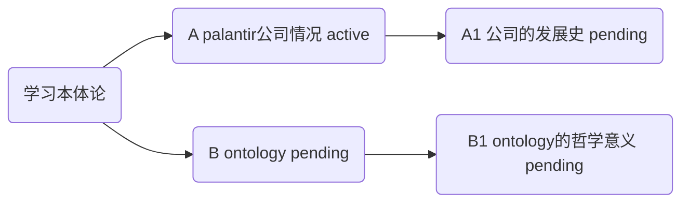

# Trailmap Lite 使用说明

[English](USAGE.md) | [产品介绍](../README.zh-CN.md)

Trailmap Lite 只做一件事：把你和 Agent 协作时出现的多条路径记录下来，方便之后提醒、切换、回看。它不参与路径本身的分析，不读取业务代码，不给排查建议。

Codex 中使用 `$trailmap`，Claude Code 中使用 `/trailmap`。下文统一用 `$trailmap` 举例。

## 1. 基本模型

一个 Chat 通常对应一个 Topic。Topic 下面有多条 Path，每条 Path 有自己的 key、标题、状态和记录。

常见状态：

```text
active   当前正在处理的路径，一个 Topic 最多一个
pending  待处理路径
paused   暂停路径
closed   已关闭路径，关闭分类为 done / blocked / discarded
```

示例：

```text
Topic: study-ontology | 学习本体论
active: A palantir公司情况
pending: A1 公司的发展史
pending: B ontology
pending: B1 ontology的哲学意义
pending: C 补充知识图谱相关知识
pending: D 数据建模和SQL
```

`A`、`B`、`C` 是根路径，`A1` 是 `A` 的子路径，`B1` 是 `B` 的子路径。

## 2. Topic 选择

选中 Topic 后，每次响应第一行固定是：

```text
Topic: <id> | <title>
```

Trailmap 通过当前 Chat 里最新的合法 Topic 标记判断当前 Topic。

- 没有 Topic：要求创建 Topic。
- 只有一个 Topic 且当前 Chat 没有标记：自动选择。
- 有多个 Topic 且当前 Chat 没有标记：只列出 ID 和标题，要求 `use <id>`。
- 恢复旧 Chat：从历史中最新的 Topic 标记恢复选择。
- 新 Chat 想用旧 Topic：执行 `use <topic-id>`。

```text
$trailmap use study-ontology
```

`list all` 是只读例外：它可以在没有选中 Topic 时列出全部 Topic 摘要，不会改变选择。

## 3. 创建 Topic

显式创建：

```text
$trailmap new 学习本体论 --id study-ontology
```

不写 `--id` 时，Trailmap 会从标题生成一个简短 ASCII slug。Topic ID、文件名创建后不再变。

如果你先输入了一个“同时记录多个路径”的命令，但当前还没有 Topic，Trailmap 会提示你输入 Topic 标题。你下一条可以直接输入标题：

```text
$trailmap 学习本体论，方向一是palantir公司情况  方向二是ontology
```

Trailmap 提示输入 Topic 标题后：

```text
学习本体论
```

结果会创建 Topic，并同时写入路径：

```text
Topic: study-ontology | 学习本体论
active: A palantir公司情况
pending: B ontology
```

这个“直接输入 Topic 标题”的例外只对上一条 Trailmap 发出的 Topic 标题提示生效一次。其他普通对话不会触发 Trailmap。

## 4. 同时记录多个路径

已选中 Topic 时，可以直接在 `$trailmap` 后面列出多个明确方向：

```text
$trailmap 学习本体论，方向一是palantir公司情况  方向二是ontology
```

Trailmap 只抽取路径标题并记录，不解释、不分析。常见列表标记如 `方向一是`、`方向二是`、`一个是`、`另一个是` 会作为分隔提示处理，路径标题保存为真正的标题部分。

空 Topic 中，第一条路径成为 `active`，其余成为 `pending`：

```text
active: A palantir公司情况
pending: B ontology
```

非空 Topic 中，多路径快捷输入会新增 pending 路径，并保持当前 active 不变：

```text
$trailmap 新增两个方向：LLM基础、权限模型
```

可能生成：

```text
pending: E LLM基础
pending: F 权限模型
```

如果文本不能明确拆出两个或多个路径，Trailmap 不写入，会要求改用显式 `pending <title>`。

## 5. 新增一条路径

### 同级新增

```text
$trailmap pending 补充知识图谱相关知识
```

如果当前 active 是根路径 `A`，默认新增同级 pending：

```text
active: A palantir公司情况
pending: B ontology
pending: C 补充知识图谱相关知识
```

### 下一级新增

```text
$trailmap pending 公司的发展史 --child
```

`--child` 表示挂到当前 active 下面：

```text
active: A palantir公司情况
pending: A1 公司的发展史
pending: B ontology
pending: C 补充知识图谱相关知识
```

### 指定 key

```text
$trailmap pending 数据建模和SQL --key D
```

结果：

```text
pending: D 数据建模和SQL
```

key 在一个 Topic 内唯一，创建后不变。

### 指定父路径

```text
$trailmap pending ontology的哲学意义 --parent B
```

结果：

```text
pending: B1 ontology的哲学意义
```

`--child` 和 `--parent <key>` 不能同时使用。

## 6. 查看路径

### `list`

```text
$trailmap
$trailmap list
```

不带子命令等价于 `list`。`list` 按树顺序显示路径：父路径后面紧跟自己的子路径，再显示下一个同级路径。不会先把所有 active/pending/paused/closed 分组。

示例：

```text
Topic: study-ontology | 学习本体论
active: A palantir公司情况
pending: A1 公司的发展史
pending: B ontology
pending: B1 ontology的哲学意义
pending: C 补充知识图谱相关知识
pending: D 数据建模和SQL
```

### `show`

```text
$trailmap show
$trailmap show B
```

`show` 显示当前 active 路径详情；没有 active 时显示 Topic 摘要。`show <key>` 显示指定路径的 title、parent、status、note、updates 和关闭字段。

### `list all`

```text
$trailmap list all
```

只显示全部 Topic 的 ID、标题、active key 和路径数量。不展开每个 Topic 的所有路径，也不改变当前选择。

## 7. 更新路径记录

### 直接更新当前 active

```text
$trailmap update 公司为政府做咨询
```

如果 `公司为政府做咨询` 不是现有 path key，则整段文本作为 note 写入当前 active 路径。不会改变路径状态。

### 指定 key 更新

```text
$trailmap update A 公司为政府做咨询
```

如果 `A` 精确匹配现有 path key，则 note 写入 A。

### 暂停当前 active

```text
$trailmap update 等待更多资料 --pause
$trailmap update A 等待更多资料 --pause
```

`--pause` 只允许作用于当前 active。成功后该路径变成 `paused`，`topic.active` 变为 `null`。

如果没有提供 note：

```text
$trailmap update
$trailmap update A
```

Trailmap 只根据当前 Chat 生成一条简短 note 草案，并显示完整的 `$trailmap update <key> <draft>` 命令；本次不写入。单独回复“确认”不会写入。

## 8. 切换路径

```text
$trailmap resume B
```

只能 resume `pending` 或 `paused` 路径。旧 active 会变成 `paused`，目标路径变成 `active`。

可选地给旧 active 留 note：

```text
$trailmap resume B --note "A 已了解基本公司情况"
```

如果目标路径已经 closed，普通 resume 不会写入，只提示显式重开：

```text
resume B --reopen --note "<reason>"
```

重开必须提供非空 reason。

## 9. 关闭路径

### 关闭当前 active

```text
$trailmap close done 已经了解完公司
```

如果第一个参数是 `done`、`blocked` 或 `discarded`，Trailmap 会关闭当前 active 路径。

### 指定 key 关闭

```text
$trailmap close A done 已经了解完公司
$trailmap close B blocked 等待资料
$trailmap close C discarded 不再需要
```

关闭会保留路径和历史 update，只改变状态并记录关闭分类、原因、时间。关闭 active 后 `topic.active` 变为 `null`，不会自动切换下一条路径。

如果没有写 reason，会记录 `未填写关闭原因`，不会由 AI 推断。

## 10. 修改路径标题

### 修改当前 active 的 title

```text
$trailmap rename 新的路径标题
```

### 修改指定路径的 title

```text
$trailmap rename A 新的路径标题
```

`rename` 只修改 path title，不修改 Topic title、Topic ID、文件名、path key、parent、status、note 或 updates。

## 11. 思维导图

### Mermaid graph

```text
$trailmap map
```

输出 Mermaid `graph LR`，根据 parent 关系展示树：


```mermaid
graph LR
  root("学习本体论") --> A("A palantir公司情况 active") & B("B ontology pending")
  A --> A1("A1 公司的发展史 pending")
  B --> B1("B1 ontology的哲学意义 pending")
```

### 纯文本树

```text
$trailmap map text
```

输出同样结构的纯文本树。

## 12. 存储结构

Trailmap 数据放在当前 workspace：

```text
.trailmap/
  topics/
    study-ontology.json
```

Topic 文件大致结构：

```json
{
  "id": "study-ontology",
  "title": "学习本体论",
  "active": "A",
  "paths": [
    {
      "key": "A",
      "title": "palantir公司情况",
      "status": "active",
      "parent": null,
      "note": "",
      "updates": []
    }
  ]
}
```

每个 Topic 独立存储。Trailmap 不创建 `index.json`，不保存全局 active topic。

## 13. 输出和安全规则

- Topic 标记始终在第一行。
- 成功写入通常只输出一行结果。
- 只读命令只展开用户请求的记录。
- 不输出解决建议，不承诺继续执行路径。
- 不输出完整 JSON。
- 不修改业务代码或 Git。
- 同一 Topic 写入前会重新读取文件并用 SHA-256 做尽力冲突检测；这不是原子锁，应避免多个 Agent 同时写同一个 Topic。

## 14. 不支持的操作

Trailmap Lite 不提供删除命令。需要退出开放路径时，用 close 保留历史：

```text
$trailmap close A discarded 不再需要
```

旧版 `mark` 前缀、clean/informed、subagent/worktree 等执行能力不属于 Lite 版本。
