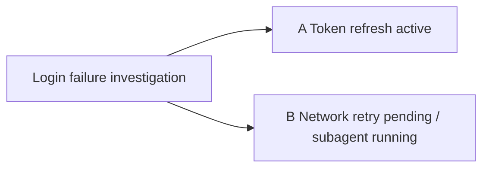

# Trailmap Subagent Parallel Exploration Design

## Goal

Allow Trailmap users to start subagent exploration for newly created or existing paths while preserving the current single-main-active-path model.

## Design Review

The design is compatible with Trailmap v0.1.0 if subagent execution is modeled separately from path status.

Trailmap must keep this invariant:

```text
Each topic has at most one main active path.
```

Subagent exploration does not create a second `active` path. It adds execution metadata to a path:

```json
{
  "key": "B",
  "status": "pending",
  "agent_run": {
    "status": "running",
    "mode": "subagent",
    "context_mode": "clean",
    "run_id": "optional-runtime-id",
    "started_at": "2026-06-24T10:00:00+08:00",
    "risk": "shared_workspace_code"
  }
}
```

Human views merge this into concise display text:

```text
B  Network retry investigation  [pending, subagent running]
```

This keeps `active/pending/paused/closed` as path lifecycle state and makes subagent progress an execution overlay.

## Commands

### Existing Path

```text
$trailmap subagent B
$trailmap subagent B --allow-shared-code
$trailmap subagent B --informed --allow-shared-code
```

`subagent <key>` starts subagent exploration for an existing path in the active topic.

Validation:

- The path must exist in the active topic.
- The path must not be the current main `active` path.
- The path must not be `closed`.
- The path must not already have `agent_run.status: running`.

### Newly Created Paths

```text
$trailmap pending Network retry may be the cause --subagent --allow-shared-code
$trailmap Login failure may be token or network; start token --subagent B --allow-shared-code
$trailmap Login failure may be token, network, or cache; start token --subagent B,C --allow-shared-code
```

Subagent startup can be attached to newly created non-main-active paths.

If no `--subagent` flag is present, Trailmap prompts only when the command creates at least one non-main-active path:

- root branch creation: A active, B/C pending
- child branch creation: A1 active, A2/A3 pending
- `pending <idea>`: new sibling pending path

If multiple candidates exist, Trailmap presents one candidate list and allows selecting zero, one, or multiple paths.

## Confirmation Rules

All state writes still require a Trailmap confirmation draft before writing to `.trailmap/marks/`.

`--allow-shared-code` means the user accepts the shared workspace risk. It does not skip the Trailmap write-confirmation draft.

Default interactive flow:

```text
Create or select subagent path
Show concise Trailmap draft
Warn that current active path and subagent path may modify shared code
Ask for explicit confirmation
Write agent_run
Start subagent
```

Explicit risk-accepted flow:

```text
$trailmap subagent B --allow-shared-code
Show concise Trailmap draft with a risk summary
Ask for write confirmation
Write agent_run
Start subagent
```

Trailmap never automatically creates worktrees, stashes, reverts, commits, switches branches, merges code, or isolates workspace files.

## Context Modes

Subagent context defaults to `clean`.

Clean context includes:

- topic title
- target path key, title, goal, and hypothesis
- target path `created_from`
- target path updates
- current main active path key/title/status as a minimal parallel-work fact
- shared workspace risk warning
- required report schema

`--informed` additionally includes summarized sibling, parent, current-active, or previously explored path conclusions. This material must be clearly labeled as other-path context.

## Agent Run Status

Valid `agent_run.status` values:

```text
running
reported
completed
failed
blocked
cancelled
```

Meanings:

- `running`: subagent is exploring the path.
- `reported`: subagent returned a report, but the report has not been confirmed into a path update.
- `completed`: user confirmed the report and Trailmap wrote the corresponding path update.
- `failed`: the subagent run failed.
- `blocked`: no subagent tool is available, or a prerequisite prevents startup.
- `cancelled`: user cancelled or explicitly abandoned the run.

Top-level `agent_run` stores only the most recent run. Historical results belong in `updates`.

If the subagent tool is unavailable, Trailmap should still create or update the path and record:

```json
{
  "agent_run": {
    "status": "blocked",
    "mode": "subagent",
    "reason": "No subagent tool is available in this agent runtime",
    "requested_at": "2026-06-24T10:00:00+08:00"
  }
}
```

## Subagent Report Schema

Subagents must return a fixed report:

```text
path_key
summary
conclusion
status_after
closed_as                 # only when status_after=closed
codechange.changed
codechange.files
codechange.summary
handoff
```

The main agent converts the report into a normal `update <key>` draft. The user must confirm before Trailmap writes the update or changes the path status.

Subagents may recommend closing a path, including `closed_as`, but may not directly close it.

If the user rejects the update draft, Trailmap does not write the update, does not revert code, and leaves `agent_run.status` as `reported`.

## Resume Behavior

If the user resumes a path with `agent_run.status: running`, Trailmap shows a warning in the normal resume confirmation:

```text
This path is currently being explored by a subagent.
Resuming it in the main session may duplicate work or mix context.
```

Trailmap does not block the resume and does not require `--force`.

## Read Views

`list`, `show`, `map`, and `map text` all show compact subagent state.

Examples:

```text
B  Network retry investigation  [pending, subagent running]
```



Read views do not expand the full subagent report unless the user asks for path details with `show <key>`.

## Out Of Scope

- Automatic Git worktree creation
- Automatic stash/revert/commit/merge
- Automatic conflict resolution
- Multiple main active paths in one topic
- Direct subagent writes to `.trailmap/marks/`
- Platform-specific required run IDs

## Success Criteria

- Existing one-active-path invariant remains intact.
- Users can start subagent exploration for existing paths and new non-main-active paths.
- Shared workspace risk is visible unless explicitly accepted by `--allow-shared-code`.
- Trailmap write confirmations are never skipped.
- Subagent reports are converted to user-confirmed path updates.
- Documentation explains that subagent parallelism is execution-level parallelism, not multiple path-status `active` values.
