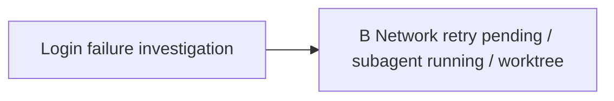

# Trailmap Subagent Worktree Design

## Goal

Add an opt-in worktree execution mode for Trailmap subagent paths so parallel exploration can be isolated from the main workspace when the user explicitly requests it.

## Design Review

The worktree mode should not replace the v0.2.0 shared-workspace subagent behavior. Shared workspace remains the default because Trailmap is primarily a decision-path recording skill, not a Git automation system.

Worktree mode is useful when a subagent path may make code changes that should not contaminate the current active path. It adds a controlled execution environment while preserving existing safety boundaries:

- Trailmap still has only one main `active` path per topic.
- Worktree execution remains an `agent_run` overlay.
- Trailmap does not auto-commit, auto-merge, auto-stash, auto-revert, copy files back, or apply patches.
- Trailmap records worktree artifacts and warnings, then lets the user inspect and integrate manually.

This is a v0.3.0 feature because it adds user-visible flags, data fields, local Git side effects, and new documentation behavior.

## Commands

Worktree mode is explicit:

```text
$trailmap subagent B --worktree
$trailmap subagent B --worktree --informed
$trailmap subagent B --worktree --base origin/main
$trailmap pending Network retry may be the cause --subagent --worktree
$trailmap Login failure may be token or network; start token --subagent B --worktree
$trailmap Login failure may be token, network, or cache; start token --subagent B,C --worktree
```

Rules:

- `--worktree` opts into isolated worktree execution.
- Default subagent execution remains shared workspace.
- `--worktree` and `--allow-shared-code` are mutually exclusive.
- `--worktree` may be combined with `--informed`.
- No `--no-worktree` flag is needed.
- `--base <ref>` optionally selects the worktree base.
- If `--base <ref>` is absent, base is current `HEAD`.
- If `--base <ref>` does not resolve, do not fall back to `HEAD`; mark the run blocked.

## Confirmation Rules

`--worktree` always requires a Trailmap confirmation draft before writing state or creating local Git objects.

The draft must show:

```text
path
context mode
base ref and base sha
branch to create
worktree path to create
whether the main workspace has uncommitted changes
whether .gitignore will be updated
that uncommitted changes will not be copied
that Trailmap will not merge, commit, stash, revert, or apply changes automatically
```

If `.worktrees/` is not ignored, Trailmap may add exactly this line after confirmation:

```text
.worktrees/
```

If `.gitignore` does not exist, Trailmap may create it after confirmation with that line. Trailmap must not reformat or reorder `.gitignore`.

## Worktree Creation

Default worktree path:

```text
.worktrees/trailmap/<topic-id>/<path-key>/
```

Default branch:

```text
trailmap/<topic-id>/<path-key>
```

The path and branch use sanitized topic IDs and path keys. If the default directory exists and is empty, it may be used. If the directory exists and is non-empty, generate a unique suffix:

```text
.worktrees/trailmap/<topic-id>/<path-key>-20260625-1430/
trailmap/<topic-id>/<path-key>-20260625-1430
```

If the branch already exists, do not reuse it. Generate the same style of unique suffix and use it for both branch and directory.

When multiple paths are launched with `--worktree`, each path gets its own worktree and branch. Partial failure is allowed:

- successful paths start normally
- failed paths record `agent_run.status: blocked`
- each failed path records `agent_run.worktree.status: failed` and a reason

## Dirty Base Behavior

If the main workspace has uncommitted changes, do not copy them into the worktree.

Record and warn:

```json
{
  "base_dirty": true
}
```

The subagent clean context must include a warning that the main workspace had uncommitted changes and they were not copied into the worktree.

## Data Model

`agent_run` gains a `worktree` object:

```json
{
  "agent_run": {
    "status": "running",
    "mode": "subagent",
    "context_mode": "clean",
    "worktree": {
      "enabled": true,
      "status": "ready",
      "path": ".worktrees/trailmap/login-timeout/B",
      "branch": "trailmap/login-timeout/B",
      "base_ref": "HEAD",
      "base_sha": "abc123",
      "base_dirty": true,
      "changed_files": [],
      "diff_summary": ""
    }
  }
}
```

Valid `agent_run.worktree.status` values:

```text
creating
ready
failed
retained
removed
```

Meanings:

- `creating`: Trailmap is preparing to create the worktree.
- `ready`: worktree exists and subagent can run in it.
- `failed`: worktree creation or validation failed.
- `retained`: subagent completed or reported, and the worktree remains for inspection.
- `removed`: worktree was later removed or manually marked removed.

Top-level `agent_run.status` rules still apply. A path may not start a new subagent run while `agent_run.status` is `running` or `reported`.

## Failure Rules

If worktree creation fails, do not automatically downgrade to shared workspace.

Record:

```json
{
  "agent_run": {
    "status": "blocked",
    "mode": "subagent",
    "worktree": {
      "enabled": true,
      "status": "failed",
      "reason": "base ref not found"
    }
  }
}
```

Tell the user how to retry:

```text
fix the worktree issue and retry --worktree
rerun without --worktree
rerun with --allow-shared-code
```

Do not start the subagent when worktree setup fails for that path.

## Results And Codechange

Worktree mode keeps code results in the worktree. Trailmap records the artifact but does not merge it.

Subagent reports in worktree mode must include:

```text
worktree.path
worktree.branch
worktree.base_ref
worktree.base_sha
worktree.changed_files
worktree.diff_summary
```

`agent_run.worktree` stores the structured worktree fields. The path update's `codechange` stores the path-level summary:

```json
{
  "codechange": {
    "changed": true,
    "files": ["src/auth/refresh.ts"],
    "summary": "Changed refresh retry handling in worktree .worktrees/trailmap/login-timeout/B."
  }
}
```

In worktree mode, changed files come from the worktree diff against `base_sha`, not from the main workspace. If the worktree diff cannot be read, record conservatively:

```json
{
  "changed": true,
  "files": [],
  "summary": "Worktree diff unavailable; inspect worktree manually."
}
```

## Cleanup

The first version does not remove worktrees automatically and does not add a cleanup command.

After subagent completion:

- `agent_run.status` becomes `reported`
- `agent_run.worktree.status` becomes `retained`
- `show <key>` displays worktree path, branch, base, changed files, and diff summary

Users inspect, merge, cherry-pick, copy, or delete worktrees manually outside Trailmap.

## Read Views

`list` and `map` show compact worktree state only:

```text
B  Network retry  [pending, subagent running, worktree]
```



`show <key>` expands:

```text
agent_run:
- status
- context mode
- execution: worktree
- worktree path
- branch
- base ref and sha
- base dirty
- changed files
- diff summary
```

## Resume Behavior

If `resume B clean` targets a path with retained worktree changes, Trailmap must warn:

```text
B has retained worktree changes not merged into the current workspace.
Resume clean will not apply those changes.
```

Clean resume includes B's own worktree artifact summary:

- worktree path
- branch
- changed files
- diff summary
- not merged warning

Clean resume does not include unconfirmed full subagent handoff reasoning unless the report was confirmed into B's updates.

## Out Of Scope

- Defaulting subagent runs to worktree mode
- `--no-worktree`
- Automatic merge, cherry-pick, patch apply, copy, commit, stash, revert, or branch switching in the main workspace
- Automatic worktree cleanup
- Reusing non-empty worktree directories
- Reusing existing worktree branches
- Falling back from `--worktree` to shared workspace without user action
- Starting a new run while the same path has `agent_run.status: running` or `reported`

## Success Criteria

- Worktree mode is explicit and opt-in.
- Shared workspace mode remains unchanged.
- Worktree and shared-code flags are mutually exclusive.
- Worktree creation is confirmed before local Git side effects occur.
- `.worktrees/` safety is checked and confirmed before `.gitignore` changes.
- Worktree metadata is stored under `agent_run.worktree`.
- Worktree result summaries are reflected in path `codechange`.
- Read views and resume warnings clearly distinguish retained worktree artifacts from current workspace code.
